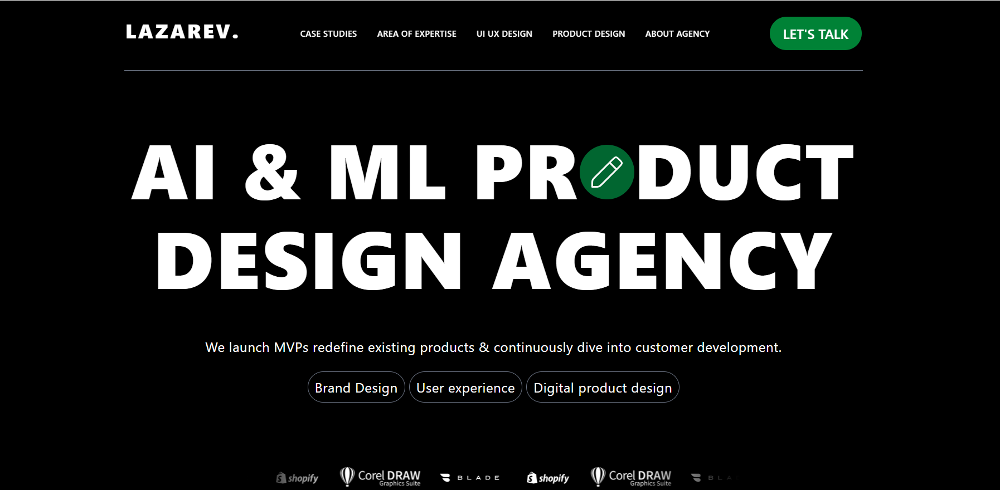
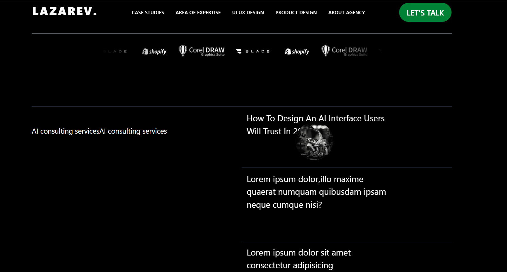
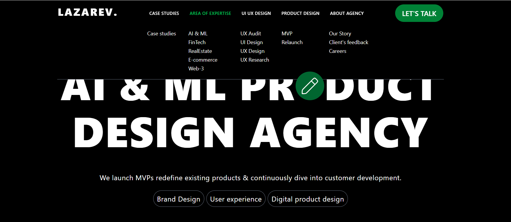
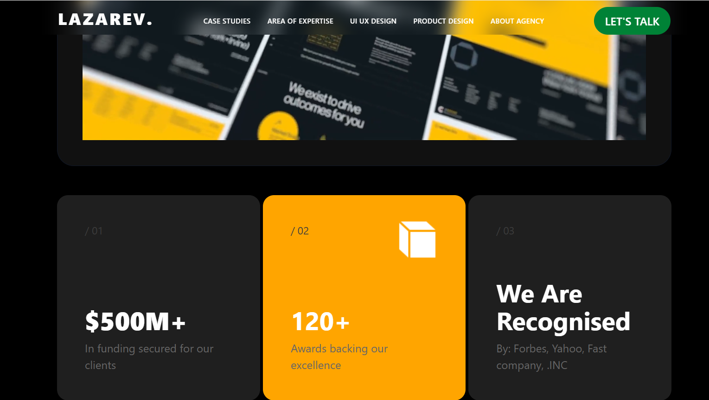

# 🚀 Lazarev UI Clone

A modern **UI clone of the Lazarev Agency website**, built to practice **advanced frontend design, animations, and interactions** using **HTML, CSS, JavaScript, Tailwind CSS, and GSAP**.

This project focuses on clean UI, smooth animations, and responsive layouts inspired by the original Lazarev design.

---

## 🛠️ Tech Stack

- **HTML5** – Semantic structure  
- **CSS3** – Custom styling  
- **Tailwind CSS** – Utility-first responsive design  
- **JavaScript (ES6+)** – Interactivity & logic  
- **GSAP** – Smooth animations & transitions  

---

## ✨ Features

- 🎨 Modern & clean UI
- ⚡ Smooth GSAP animations
- 📱 Fully responsive layout
- 🎯 Hover & scroll-based effects
- 🧩 Well-structured and readable code

---

## 📸 Screenshots

_Add screenshots of your project UI below._

### Home Page


### Animations Section




---

## 📂 Project Structure

```bash
Lazarev-UI-Clone/
│
├── index.html
├── style.css
├── script.js
├── assets/
├── screenshots/
│   ├── home.png
│   ├── animations.png
└── README.md
